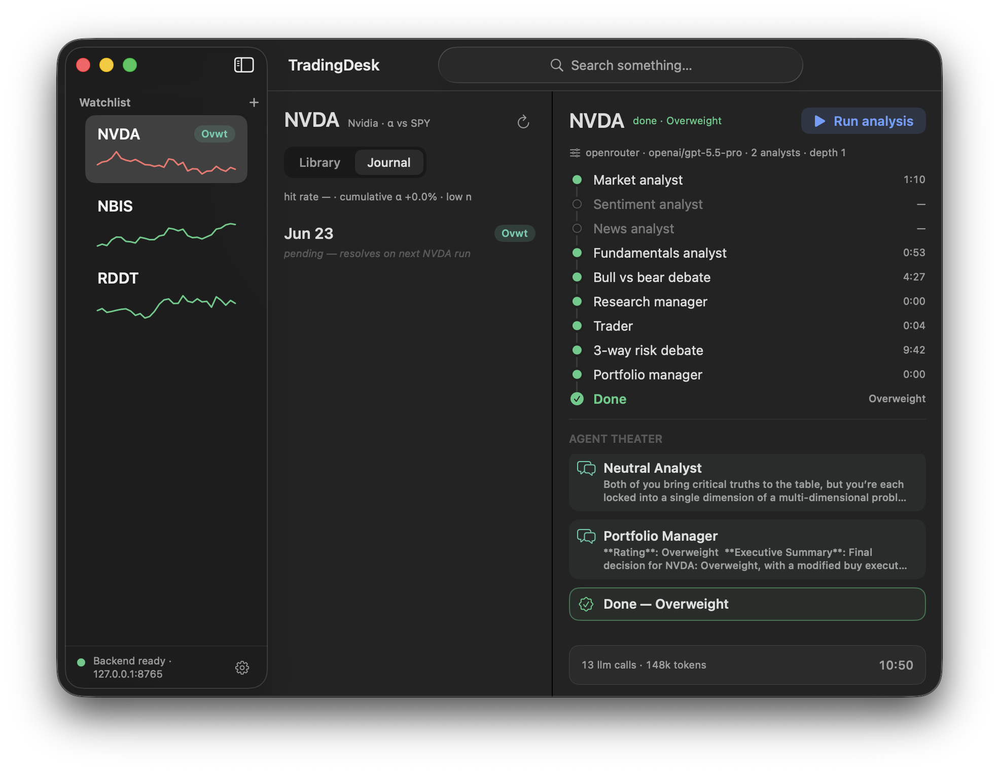

<h1 align="center">TickTalk</h1>

<p align="center">
  <b>A native macOS app for multi-agent LLM financial analysis.</b><br>
  A persistent research desk over the open-source <a href="https://github.com/TauricResearch/TradingAgents">TradingAgents</a> engine — watch a team of agents debate a trade, live.
</p>

<p align="center">
  
  
  
  <a href="https://github.com/TauricResearch/TradingAgents"></a>
</p>



---

## What is TickTalk?

**TickTalk** is a native macOS app (SwiftUI, macOS 14+) that turns the [TradingAgents](https://github.com/TauricResearch/TradingAgents) multi-agent engine into a **persistent research workspace**.

The engine's CLI is a one-shot wizard: answer prompts, watch one analysis stream past in the terminal, and it exits — the output scrolls away. TickTalk reconceives that as a durable, multi-ticker desk:

- a **watchlist** of tracked tickers, each showing its latest decision and realized return,
- every run saved as a **permanent document** you can reopen,
- a **decisions journal** that closes the loop with realized alpha, and
- a live **Agent Theater** that streams every analyst step, tool call, and bull/bear debate turn as it happens.

It drives the engine **without modifying the agent graph** — every analysis is the exact same LangGraph the CLI runs, executed inside a Docker backend the app starts and health-checks for you. This is a GUI front-end, not a fork of the engine.

> ⚠️ TickTalk and the TradingAgents engine are **research tools**. Trading performance varies with the model, data, and many non-deterministic factors. This is **not** financial, investment, or trading advice.

## How it differs from the CLI

|  | CLI (`tradingagents`) | TickTalk (this app) |
|---|---|---|
| **Shape** | One-shot wizard, run-and-exit | Persistent workspace that survives across launches |
| **Tracking** | No watchlist concept | **Watchlist** of tracked tickers — each row shows its latest decision, realized return since that date, and a stale-clock for aging decisions |
| **Run output** | Reports printed to stdout, gone on scroll | Runs are **permanent documents** (a per-ticker Library) you can reopen any time |
| **Outcomes** | — | A **Decisions Journal** (from the engine's memory log) that closes the loop with realized alpha; pending outcomes resolve on a schedule |
| **Watching a run** | Text streamed to the terminal | A **Live Monitor / Agent Theater** — every agent step, tool call/result, and bull/bear + 3-way risk **debate turn** rendered live as cards over SSE |
| **Navigation** | Sequential interactive prompts | A **⌘K command palette** over real tickers (live lookup → add to watchlist), past runs, and decisions |
| **Secrets** | `.env` on disk | Keys entered **once** and saved to the **macOS Keychain** — shown masked on return, reused automatically for every run, never re-entered or written to disk |
| **Config** | Re-answer prompts every run | **Settings / Profiles** — provider + model picked live from the engine, per-key connectivity tests, research depth, output language, System/Light/Dark |

## Features

- **Ticker Desk** — a Watchlist sidebar (live decisions + realized return + sparklines), and per-ticker **Journal** and **Library** of saved run documents.
- **Live Monitor + Agent Theater** — streams the whole agent timeline live (analyst steps, tool calls/results, the Bull/Bear and 3-way risk debates) over SSE; a finished run refreshes the watchlist and journal immediately, no polling.
- **Command palette (⌘K)** — find and jump to tickers / runs / decisions from the title bar; add any listed instrument via live search.
- **Settings** — live provider/model selection (incl. the OpenRouter catalog), Keychain-stored keys with per-row connectivity tests, research-depth presets, and a System / Light / Dark appearance switch.
- **Self-managed backend** — `DockerBackendController` starts and health-checks the engine container on launch (and stops it on quit); plus menu-bar quick actions and a native Dock icon.

## Requirements

- **macOS 14 (Sonoma)** or later
- **Xcode 26 / Swift 6** toolchain — to build from source
- **Docker Desktop** — runs the engine backend container
- An API key for at least one LLM provider (OpenAI, Anthropic, Google, xAI, DeepSeek, OpenRouter, or any OpenAI-compatible endpoint)

## Quick start

```bash
git clone https://github.com/Lotus2077/TickTalk.git
cd TickTalk

# 1. Build the engine backend image (TradingAgents + FastAPI/SSE server)
docker compose build desk-server

# 2. Build and launch the macOS app (compiles the SwiftPM target, assembles the .app)
macos/TickTalk/scripts/make-preview-app.sh
open macos/TickTalk/.build/TickTalk.app
```

On first launch TickTalk starts and health-checks its backend on `127.0.0.1:8765`. Open **Settings**, paste your provider's API key (stored in the macOS Keychain — entered once), pick a model, add a ticker, and run your first analysis.

> **Avoiding repeated Keychain prompts (optional, dev):** each rebuild re-signs the binary, which re-arms the macOS signing prompt. Run `bash macos/TickTalk/scripts/dev-signing-setup.sh` once to create a stable self-signed identity. See [`docs/ARCHITECTURE.md`](docs/ARCHITECTURE.md) for details.

## Configuration

- **API keys** live in the macOS Keychain under the service `io.github.lotus2077.ticktalk`, entered once in Settings and injected into the backend **per run** — never written to disk.
- **Backend** runs on loopback only (`127.0.0.1:8765`) and is managed by the app; secrets are never read from `.env` (`TRADINGAGENTS_NO_DOTENV=1`).
- **Research depth, models, output language, and appearance** are all set in Settings.

## Architecture

```
TickTalk.app (SwiftUI)                         Docker container (python:3.12-slim)
  RootSplitView ── DockerBackendController ──────▶ desk-server (FastAPI + uvicorn)
     │  start container, poll /health                 │  desk_server.app
  RunCoordinator ── HTTP + SSE @127.0.0.1:8765 ──────▶ ├─ desk_adapter.diff (snapshots → events)
     │  POST /runs · GET /runs/{id}/events (SSE)        ├─ TradingAgentsGraph.stream_run() (engine)
  KeychainStore (provider keys → injected per run)      └─ dataflows (yfinance / FRED / news / …)
```

Full design notes — every surface with its rationale, the event protocol, and known constraints — are in **[`docs/ARCHITECTURE.md`](docs/ARCHITECTURE.md)**.

---

## The engine: TradingAgents

TickTalk is built on **[TradingAgents](https://github.com/TauricResearch/TradingAgents)**, a multi-agent trading framework that mirrors the dynamics of a real trading firm. Specialized LLM agents — fundamental, sentiment, news, and technical analysts; bull/bear researchers; a trader; and a risk-management team — collaboratively evaluate market conditions and debate the optimal call.

<p align="center">
  
</p>

The engine is included in this repo **unchanged** (the `tradingagents` and `cli` packages); TickTalk wraps it with the `desk_server`/`desk_adapter` backend and the macOS app. You can also use the engine directly.

### Using the engine from the CLI

```bash
pip install .          # installs the `tradingagents` console command
tradingagents          # interactive CLI: pick ticker, date, provider, depth
```

TradingAgents works with any market Yahoo Finance covers, using the exchange-suffixed ticker (`AAPL`, `0700.HK`, `7203.T`, `RELIANCE.NS`, `600519.SS`, `BTC-USD`, …).

### Provider keys (CLI / engine)

Set the API key for your chosen provider (the macOS app manages these for you via the Keychain):

```bash
export OPENAI_API_KEY=...          # OpenAI (GPT)
export ANTHROPIC_API_KEY=...       # Anthropic (Claude)
export GOOGLE_API_KEY=...          # Google (Gemini)
export XAI_API_KEY=...             # xAI (Grok)
export DEEPSEEK_API_KEY=...        # DeepSeek
export OPENROUTER_API_KEY=...      # OpenRouter (catalog of many models)
# …and more — see `.env.example`. Azure: `.env.enterprise.example`. AWS Bedrock: `pip install ".[bedrock]"`.
```

For local models, set `llm_provider: "ollama"` (default `http://localhost:11434/v1`); for any OpenAI-compatible server (vLLM, LM Studio, llama.cpp) use `llm_provider: "openai_compatible"` and `backend_url`.

### Using the engine from Python

```python
from tradingagents.graph.trading_graph import TradingAgentsGraph
from tradingagents.default_config import DEFAULT_CONFIG

ta = TradingAgentsGraph(debug=True, config=DEFAULT_CONFIG.copy())
_, decision = ta.propagate("NVDA", "2026-01-15")
print(decision)
```

See `tradingagents/default_config.py` for all options. The engine persists a decision log (`~/.tradingagents/memory/`) and supports opt-in LangGraph checkpoint resume (`--checkpoint`).

---

## Built on TradingAgents

This project includes and builds on **[TradingAgents](https://github.com/TauricResearch/TradingAgents)** by TauricResearch, licensed under the **Apache License 2.0**. The engine (`tradingagents`, `cli`) is vendored with minor host-adaptation changes; the `desk_server`/`desk_adapter` backend, the `macos/TickTalk` app, and the "TickTalk" branding are additions. See [`NOTICE`](NOTICE) for full attribution.

## Contributing

Contributions are welcome — see [`CONTRIBUTING.md`](CONTRIBUTING.md). Engine-level improvements ideally also go upstream to [TradingAgents](https://github.com/TauricResearch/TradingAgents).

## License

[Apache License 2.0](LICENSE). See [`NOTICE`](NOTICE) for attribution of the bundled TradingAgents engine.

## Citation

If the underlying TradingAgents framework helps your work, please cite it:

```bibtex
@misc{xiao2025tradingagentsmultiagentsllmfinancial,
      title={TradingAgents: Multi-Agents LLM Financial Trading Framework},
      author={Yijia Xiao and Edward Sun and Di Luo and Wei Wang},
      year={2025},
      eprint={2412.20138},
      archivePrefix={arXiv},
      primaryClass={q-fin.TR},
      url={https://arxiv.org/abs/2412.20138},
}
```
